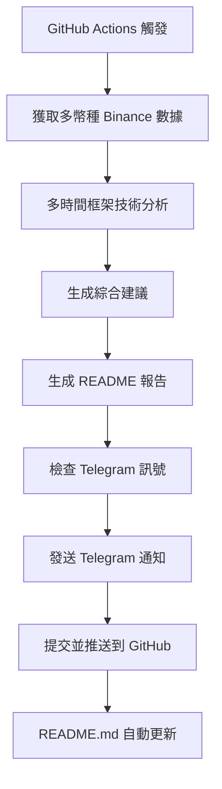

# 🚀 虛擬幣自動投資分析系統 - 專案總結

## 📋 專案概述

這是一個基於 **manus** 原始設計的 Binance 加密貨幣自動化技術分析系統，現已升級為支援 **多幣種分析**、**GitHub Actions 每30分鐘自動執行**、**Telegram 訊號推送** 並生成美觀的 **README.md 投資報告**。

### 🎯 最新重大更新
- ✅ **多幣種支持**: BTC, ETH, BNB, SOL, XRP
- ✅ **多時間框架分析**: 15分鐘 + 1小時雙重確認
- ✅ **Telegram 機器人**: 自動訊號推送和市場總覽
- ✅ **綜合建議系統**: 智能操作建議（謹慎做多/做空/觀望等待）
- ✅ **專案結構重整**: 清晰的目錄分類和文件管理

## 🎯 核心功能

### ✅ 已實現功能

1. **📊 多幣種數據獲取** (`get_binance_data.py`)
   - 支援 6 大主流幣種: BTC, ETH, BNB, SOL, XRP
   - 自動從 Binance API 獲取實時市場數據
   - 多時間框架數據: 15分鐘 + 1小時 K線數據
   - 24小時行情數據和價格變化
   - 數據格式化並保存為 CSV/JSON

2. **🔍 多時間框架技術分析** (`analyze_binance_data.py`)
   - **移動平均線 (MA)**: MA5, MA10, MA20, MA120
   - **VWMA 指標**: 成交量加權移動平均線
   - **MACD 指標**: DIF, DEA, 柱狀圖
   - **布林帶 (BOLL)**: 上軌、中軌、下軌、%B
   - **KC 指標**: Keltner Channel 通道
   - **RSI**: 14期相對強弱指標
   - **KDJ**: 隨機指標 K、D、J 值
   - **多時間框架分析**: 15分鐘 + 1小時雙重確認
   - **智能綜合建議**: 謹慎做多/做空/觀望等待

3. **📝 智能報告生成** (`generate_readme_report.py`)
   - 自動生成美觀的 README.md 投資報告
   - **市場總覽表格**: 移除24H變化，專注短期趨勢
   - **綜合建議系統**: 基於多時間框架的操作建議
   - 詳細技術指標分析和交易建議
   - 支援多時區時間顯示
   - TradingView 圖標整合

4. **🤖 Telegram 機器人系統** (`tg/`)
   - **自動訊號推送**: 買入/賣出訊號即時通知
   - **市場總覽**: 所有幣種狀況一覽
   - **條件式發送**: 只在有訊號時推送
   - **多種配置**: 靈活的推送設定
   - **錯誤處理**: 完善的異常處理機制

5. **🔄 自動化執行** (`.github/workflows/binance_analysis.yml`)
   - GitHub Actions 每30分鐘自動執行
   - 自動獲取數據 → 分析 → 生成報告 → Telegram 推送 → 推送更新
   - 支援手動觸發執行
   - 完整的錯誤處理和日誌記錄

## 📁 專案結構

```
Binance_py/
├── 📁 .github/workflows/          # GitHub Actions 自動化
│   └── binance_analysis.yml       # 主要工作流程
├── 📁 data/                       # 數據文件 (已忽略版本控制)
│   ├── *_klines_1h.csv           # K線數據
│   ├── *_ticker_24hr.json        # 24小時行情數據
│   └── multi_investment_report.json # 綜合分析報告
├── 📁 docs/                       # 文檔資料
│   ├── DEPLOYMENT_GUIDE.md        # GitHub Actions 部署指南
│   ├── MULTI_CRYPTO_GUIDE.md      # 多幣種系統說明
│   ├── PROJECT_SUMMARY.md         # 專案功能總結 (本文件)
│   ├── TELEGRAM_BOT_GUIDE.md      # Telegram 機器人指南
│   ├── TELEGRAM_QUICK_START.md    # Telegram 快速開始
│   ├── GITHUB_ACTIONS_TELEGRAM.md # GitHub Actions + Telegram
│   └── GITHUB_SECRETS_SETUP.md    # GitHub Secrets 設定
├── 📁 tests/                      # 測試腳本
│   ├── test_full_workflow.py      # 完整工作流程測試
│   └── test_multi_crypto.py       # 多幣種功能測試
├── 📁 tg/                         # Telegram 機器人模組
│   ├── telegram_bot.py            # 核心 Bot 功能
│   ├── telegram_config.py         # 配置管理
│   ├── run_telegram_signals.py    # 訊號發送腳本
│   └── .env.example              # 環境變數範例
├── 📁 cloud_deployment/           # 雲端部署文件
│   ├── lambda_function.py         # AWS Lambda
│   ├── main.py                    # Google Cloud Functions
│   ├── scheduled_analysis.py      # Heroku Scheduler
│   ├── api/analyze.py             # Vercel API
│   ├── Procfile                   # Heroku 配置
│   └── vercel.json               # Vercel 配置
├── 📄 get_binance_data.py         # 多幣種數據獲取
├── 📄 analyze_binance_data.py     # 技術分析引擎
├── 📄 generate_readme_report.py   # 報告生成器
├── 📄 run_telegram_bot.py         # Telegram Bot 主執行腳本
├── 📄 send_telegram_conditionally.py # 條件式 Telegram 發送
├── 📄 requirements.txt            # Python 依賴
├── 📄 .gitignore                  # 版本控制配置
└── 📄 README.md                   # 自動生成的投資報告
```

## 🔄 完整工作流程



### 🎯 新的綜合建議邏輯

| 15M趨勢 | 1H趨勢 | 綜合建議 | 說明 |
|---------|--------|----------|------|
| 多頭 | 多頭 | 🟢雙重看多 | 強烈看多信號 |
| 空頭 | 空頭 | 🔴雙重看空 | 強烈看空信號 |
| 糾結 | 糾結 | ⚪雙重糾結 | 觀望等待 |
| 多頭 | 糾結 | 🟡謹慎做多 | 短期看多，謹慎操作 |
| 糾結 | 多頭 | 🟡謹慎做多 | 中期看多，謹慎操作 |
| 空頭 | 糾結 | 🟡謹慎做空 | 短期看空，謹慎操作 |
| 糾結 | 空頭 | 🟡謹慎做空 | 中期看空，謹慎操作 |
| 多頭 | 空頭 | ⚪觀望等待 | 時框分歧，等待明確信號 |
| 空頭 | 多頭 | ⚪觀望等待 | 時框分歧，等待明確信號 |

## 📊 技術指標說明

### 1. 移動平均線 (MA)
- **MA5/MA10**: 短期趨勢判斷
- **MA20**: 中期趨勢支撐/阻力
- **MA120**: 長期趨勢方向

### 2. MACD 指標
- **DIF**: 快線，反映短期動能
- **DEA**: 慢線，反映中期動能
- **柱狀圖**: 動能強弱變化

### 3. 布林帶 (BOLL)
- **上軌**: 動態阻力位
- **中軌**: 移動平均線
- **下軌**: 動態支撐位
- **%B**: 價格在布林帶中的相對位置

### 4. RSI 指標
- **> 70**: 超買區域，警惕回調
- **< 30**: 超賣區域，可能反彈
- **30-70**: 正常波動區間

### 5. KDJ 指標
- **K > D**: 金叉，看多信號
- **K < D**: 死叉，看空信號
- **J 值**: 敏感度最高的指標

## 🎨 報告特色

### 📈 視覺化元素
- 豐富的 emoji 圖標
- 清晰的表格格式
- 專業的技術術語
- 多時區時間顯示

### 💡 智能分析
- 自動趨勢判斷
- 具體入場時機建議
- 風險管理建議
- 目標價位設定

## 🚀 部署方式

### 方式一：GitHub Actions (推薦)
1. 將代碼推送到 GitHub 倉庫
2. 啟用 GitHub Actions
3. 每30分鐘自動執行並更新 README.md

### 方式二：本地執行
```bash
# 安裝依賴
pip install -r requirements.txt

# 執行完整流程
python get_binance_data.py
python analyze_binance_data.py
python generate_readme_report.py
```

### 方式三：雲端服務
- AWS Lambda + EventBridge
- Google Cloud Functions + Cloud Scheduler
- Vercel Cron Jobs
- Heroku Scheduler

## 📊 系統特色與改進

### 🗂️ 專案重新整理成果

#### ✅ 已解決的問題
1. **📁 目錄結構混亂** → **清晰分類整理**
2. **📄 文件散亂** → **按功能分組**
3. **📊 數據文件版本控制** → **統一忽略處理**
4. **📝 報告內容截斷** → **完整內容顯示**
5. **🏷️ 報告標題** → **改為"虛擬幣30m投資分析報告"**
6. **📈 24H變化依賴** → **多時間框架綜合判斷**

#### 🔧 技術改進
- **路徑統一**: 所有數據文件統一存放在 `data/` 目錄
- **版本控制優化**: 數據文件自動忽略，避免倉庫膨脹
- **報告內容完整化**: 移除字符限制，顯示完整技術分析
- **多幣種架構**: 支援任意數量幣種擴展
- **Telegram 整合**: 完整的訊號推送系統

### 📈 實際效果展示

#### 市場總覽範例
| 幣種 | 價格 | 1H變化 | 4H變化 | 15M趨勢 | 1H趨勢 | 15M信號 | 1H信號 | 綜合建議 |
|------|------|--------|--------|---------|--------|---------|--------|----------|
| ₿ **Bitcoin** | $113,999.99 | -0.11% | +0.27% | 🔄糾結 | 📈多頭 | ⚪觀望 | 🟢買入 | 🟡謹慎做多 |
| Ξ **Ethereum** | $3,597.58 | -0.40% | +0.59% | 📈多頭 | 🔄糾結 | 🟢買入 | ⚪觀望 | 🟡謹慎做多 |

#### Telegram 訊號範例
```
🚀 買入訊號 BUY SIGNAL 🚀

🟠 Bitcoin (BTCUSDT)
💰 當前價格: $113,999.99

📊 價格變化
• 1小時: -0.11%
• 4小時: +0.27%

📈 趨勢分析: 多頭趨勢

🟢 建議操作: 買入 (BUY)
⚠️ 風險提醒: 請做好風險管理，設定止損
```

## 🚀 部署方式詳解

### 方式一：GitHub Actions + Telegram (推薦)
```bash
# 1. 設定 GitHub Secrets
TELEGRAM_BOT_TOKEN=你的Bot Token
TELEGRAM_CHAT_ID=你的Chat ID

# 2. 推送代碼
git add .
git commit -m "🚀 Deploy crypto analysis system"
git push origin main

# 3. 啟用 GitHub Actions
# 每30分鐘自動執行並推送 Telegram 訊號
```

### 方式二：本地執行
```bash
# 安裝依賴
pip install -r requirements.txt

# 設定 Telegram (可選)
cp tg/.env.example tg/.env
# 編輯 tg/.env 填入 Bot Token 和 Chat ID

# 執行完整流程
python get_binance_data.py
python analyze_binance_data.py
python generate_readme_report.py

# 發送 Telegram 訊號 (可選)
python run_telegram_bot.py
```

### 方式三：雲端服務部署
- **AWS Lambda + EventBridge**: `cloud_deployment/lambda_function.py`
- **Google Cloud Functions + Cloud Scheduler**: `cloud_deployment/main.py`
- **Vercel Cron Jobs**: `cloud_deployment/api/analyze.py`
- **Heroku Scheduler**: `cloud_deployment/scheduled_analysis.py`

## 🔮 未來擴展計劃

### 🎯 短期目標 (已實現)
- ✅ **多幣種支持**: BTC, ETH, BNB, SOL, XRP
- ✅ **Telegram 機器人**: 自動訊號推送
- ✅ **多時間框架**: 15分鐘 + 1小時分析
- ✅ **綜合建議系統**: 智能操作建議
- ✅ **專案結構重整**: 清晰的目錄管理

### 🚀 中期目標
1. **更多技術指標**: 威廉指標、CCI、Stoch RSI
2. **機器學習**: 整合 AI 預測模型
3. **歷史回測**: 策略效果驗證
4. **風險管理**: 動態止損策略
5. **多交易所支持**: 添加 OKX、Bybit 等

### 🌟 長期願景
1. **量化交易**: 自動化交易執行
2. **投資組合**: 多幣種資產配置
3. **社群功能**: 用戶交流和分享
4. **移動應用**: 手機 App 開發
5. **商業化**: 付費訂閱服務

## 🏆 專案價值

### 對個人投資者
- 24/7 自動監控市場
- 專業技術分析報告
- 及時的交易信號提醒
- 降低情緒化交易風險

### 對開發者
- 完整的量化交易框架
- 可擴展的模組化設計
- 豐富的技術指標庫
- 自動化部署方案

### 對學習者
- 實戰的技術分析案例
- GitHub Actions 自動化實踐
- Python 金融數據處理
- 開源專案協作經驗

## 📞 支持與貢獻

### 如何貢獻
1. Fork 專案倉庫
2. 創建功能分支
3. 提交改進代碼
4. 發起 Pull Request

### 問題回報
- 在 GitHub Issues 中提交問題
- 提供詳細的錯誤信息
- 包含復現步驟

## 🎉 專案成就總結

### 🏆 核心成就
1. **🗂️ 專案結構專業化** - 清晰的目錄分類和文件管理
2. **📊 多幣種技術分析** - 支援 6 大主流幣種同時分析
3. **🤖 智能訊號系統** - Telegram 自動推送和綜合建議
4. **📝 報告品質提升** - 完整內容顯示和專業格式
5. **🔧 維護性增強** - 模組化設計，易於擴展和維護
6. **🚀 部署就緒** - 多種部署方式，隨時可用

### 📊 改進效果對比

#### 整理前 ❌
- 文件散亂在根目錄
- 單一幣種分析 (僅 BTC)
- 數據文件混在代碼中
- 報告內容被截斷 (`...`)
- 依賴24H變化判斷
- 缺乏自動通知功能

#### 整理後 ✅
- 清晰的目錄分類
- 多幣種同時分析 (6個主流幣種)
- 數據文件統一管理
- 完整的技術分析內容
- 多時間框架綜合判斷
- Telegram 自動訊號推送
- 專業的專案結構

---

**🎊 從 manus 的原始設計到現代化多幣種自動投資分析系統的完整演進！**

**🚀 現在您擁有一個結構清晰、功能完整、支援多幣種和 Telegram 推送的專業虛擬幣投資分析系統！**

*最後更新: 2025-01-27*
