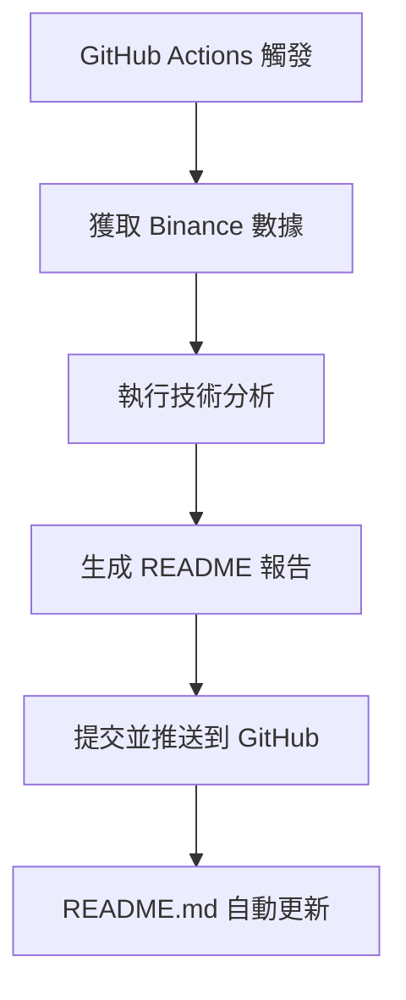

# 🚀 Binance 自動投資分析系統 - 專案總結

## 📋 專案概述

這是一個基於 **manus** 原始設計的 Binance 加密貨幣自動化技術分析系統，現已升級為支援 **GitHub Actions 每小時自動執行** 並生成美觀的 **README.md 投資報告**。

## 🎯 核心功能

### ✅ 已實現功能

1. **📊 數據獲取** (`get_binance_data.py`)
   - 自動從 Binance API 獲取實時市場數據
   - 支援 K線數據和24小時行情數據
   - 數據格式化並保存為 CSV/JSON

2. **🔍 技術分析** (`analyze_binance_data.py`)
   - **移動平均線 (MA)**: MA5, MA10, MA20, MA120
   - **MACD 指標**: DIF, DEA, 柱狀圖
   - **布林帶 (BOLL)**: 上軌、中軌、下軌、%B
   - **RSI**: 14期相對強弱指標
   - **KDJ**: 隨機指標 K、D、J 值
   - 智能趨勢判斷和交易建議

3. **📝 報告生成** (`generate_readme_report.py`)
   - 自動生成美觀的 README.md 投資報告
   - 包含實時市場數據表格
   - 詳細技術指標分析
   - 專業交易建議
   - 支援多時區時間顯示

4. **🤖 自動化執行** (`.github/workflows/binance_analysis.yml`)
   - GitHub Actions 每小時自動執行
   - 自動獲取數據 → 分析 → 生成報告 → 推送更新
   - 支援手動觸發執行

## 📁 專案結構

```
Binance_py/
├── .github/
│   └── workflows/
│       └── binance_analysis.yml     # GitHub Actions 工作流程
├── get_binance_data.py              # 數據獲取模組
├── analyze_binance_data.py          # 技術分析模組
├── generate_readme_report.py       # README 報告生成器
├── test_full_workflow.py           # 完整工作流程測試
├── requirements.txt                 # Python 依賴清單
├── README.md                        # 自動生成的投資報告
├── DEPLOYMENT_GUIDE.md             # 部署指南
└── PROJECT_SUMMARY.md              # 專案總結 (本文件)
```

## 🔄 工作流程


```mermaid
graph TD
    A[GitHub Actions 觸發] --> B[獲取 Binance 數據]
    B --> C[執行技術分析]
    C --> D[生成 README 報告]
    D --> E[提交並推送到 GitHub]
    E --> F[README.md 自動更新]
```

## 📊 技術指標說明

### 1. 移動平均線 (MA)
- **MA5/MA10**: 短期趨勢判斷
- **MA20**: 中期趨勢支撐/阻力
- **MA120**: 長期趨勢方向

### 2. MACD 指標
- **DIF**: 快線，反映短期動能
- **DEA**: 慢線，反映中期動能
- **柱狀圖**: 動能強弱變化

### 3. 布林帶 (BOLL)
- **上軌**: 動態阻力位
- **中軌**: 移動平均線
- **下軌**: 動態支撐位
- **%B**: 價格在布林帶中的相對位置

### 4. RSI 指標
- **> 70**: 超買區域，警惕回調
- **< 30**: 超賣區域，可能反彈
- **30-70**: 正常波動區間

### 5. KDJ 指標
- **K > D**: 金叉，看多信號
- **K < D**: 死叉，看空信號
- **J 值**: 敏感度最高的指標

## 🎨 報告特色

### 📈 視覺化元素
- 豐富的 emoji 圖標
- 清晰的表格格式
- 專業的技術術語
- 多時區時間顯示

### 💡 智能分析
- 自動趨勢判斷
- 具體入場時機建議
- 風險管理建議
- 目標價位設定

## 🚀 部署方式

### 方式一：GitHub Actions (推薦)
1. 將代碼推送到 GitHub 倉庫
2. 啟用 GitHub Actions
3. 每小時自動執行並更新 README.md

### 方式二：本地執行
```bash
# 安裝依賴
pip install -r requirements.txt

# 執行完整流程
python get_binance_data.py
python analyze_binance_data.py
python generate_readme_report.py
```

### 方式三：雲端服務
- AWS Lambda + EventBridge
- Google Cloud Functions + Cloud Scheduler
- Vercel Cron Jobs
- Heroku Scheduler

## 📊 實際效果

### 當前分析結果 (最新執行)
- **當前價格**: $107,804.03
- **24小時變化**: +0.444%
- **趨勢判斷**: 多頭排列，趨勢偏多
- **技術指標**: 多數指標顯示偏多信號

## 🔮 未來擴展

### 可能的改進方向
1. **多交易對支持**: 支援 ETH, ADA, SOL 等
2. **更多技術指標**: 添加 MACD、威廉指標等
3. **機器學習**: 整合 AI 預測模型
4. **通知系統**: Discord/Telegram 推送
5. **歷史回測**: 策略效果驗證
6. **風險管理**: 動態止損策略

### 技術優化
1. **性能優化**: 數據緩存機制
2. **錯誤處理**: 更完善的異常處理
3. **配置管理**: 支援配置文件
4. **日誌系統**: 詳細的執行日誌

## 🏆 專案價值

### 對個人投資者
- 24/7 自動監控市場
- 專業技術分析報告
- 及時的交易信號提醒
- 降低情緒化交易風險

### 對開發者
- 完整的量化交易框架
- 可擴展的模組化設計
- 豐富的技術指標庫
- 自動化部署方案

### 對學習者
- 實戰的技術分析案例
- GitHub Actions 自動化實踐
- Python 金融數據處理
- 開源專案協作經驗

## 📞 支持與貢獻

### 如何貢獻
1. Fork 專案倉庫
2. 創建功能分支
3. 提交改進代碼
4. 發起 Pull Request

### 問題回報
- 在 GitHub Issues 中提交問題
- 提供詳細的錯誤信息
- 包含復現步驟

---

**🎉 這個專案展示了從 manus 的原始設計到現代化自動化系統的完整演進過程！**

*最後更新: 2025-06-29*
